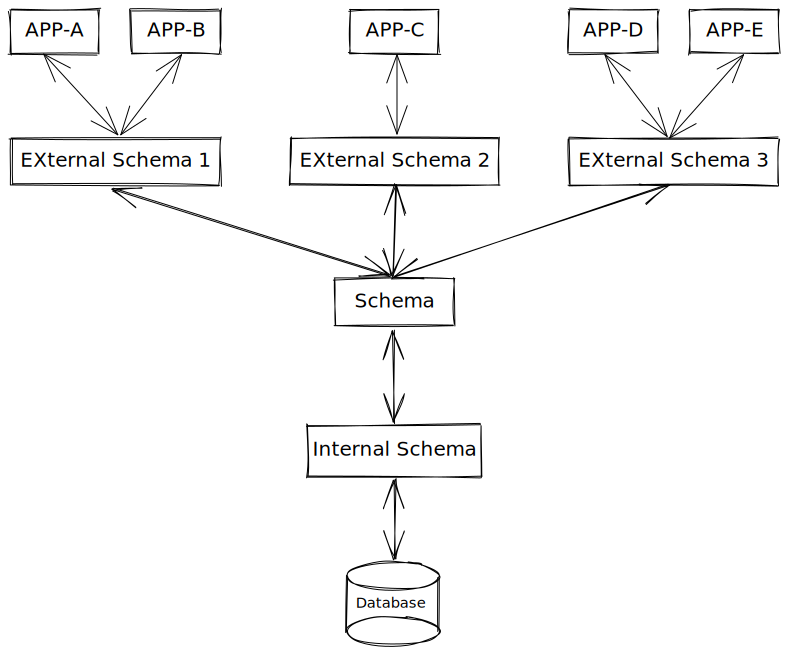

# 第一章\~绪论

## 1.1 数据库系统概述 

### 1.1.1 数据库的 4 个基本概念 


<mark style="color:red;">数据</mark>、<mark style="color:red;">数据库</mark>、<mark style="color:red;">数据管理系统</mark>、<mark style="color:red;">数据库系统</mark> 是与数据技术密切相关的4个基本概念


*   **数据(Data)**

    数据是是数据库的基本对象，<mark style="color:purple;">描述事物的符号记录称为</mark><mark style="color:red;">数据</mark>
*   **数据库(Database，DB)**

    数据库是长期存储在计算机内、有组织的、可共享的大量数据的集合。数据库中的数据按一定的数据模型组织、描述和存储，具有较小的数冗余度、较高的数据独立性和易扩展性，并可为各种用户共享
*   **数据库管理系统(Database Management System，DBMS)**

    数据库管理系统是位于用户和操作系统之间的一层数据库管理软件，和操作系统一样是计算机的基础软件

    功能主要包括：<mark style="color:green;">数据定义功能</mark>；<mark style="color:orange;">数据组织、存储和管理</mark>；<mark style="color:red;">数据操纵功能</mark>；<mark style="color:blue;">数据库的事物管理和运行管</mark>理；数据库的建立和维护功能
*   **数据库系统(Database System，DBS)**

    数据库系统是由<mark style="color:blue;">数据库</mark>、<mark style="color:purple;">数据库管理系统</mark>、<mark style="color:orange;">应用程序</mark>和<mark style="color:red;">数据库管理员(DBA)</mark>组成的<mark style="color:green;">存储、管理、处理和维护数据的系统</mark>

### 1.1.2 数据管理技术的产生和发展 


数据库技术是应数据管理任务的需求而产生的。数据管理是指对数据进行分类、组织、编码、存储和、加工和维护，它是数据处理的中心问题


**数据管理技术的三个阶段：**<mark style="color:purple;">**人工管理阶段**</mark>**、**<mark style="color:orange;">**文件系统阶段**</mark>**、**<mark style="color:red;">**数据库系统阶段**</mark>

| 背景/特点   | 人工管理阶段      | 文件系统阶段       | 数据库系统阶段                      |
| ------- | ----------- | ------------ | ---------------------------- |
| 应用背景    | 科学计算        | 科学计算、数据管理    | 大规模数据管理                      |
| 硬件背景    | 无直接存取存储设备   | 磁盘、磁鼓        | 大容量硬盘、磁盘阵列                   |
| 处理方式    | 没有操作系统      | 有文件系统        | 有数据库管理系统                     |
| 数据的管理者  | 用户(程序员)     | 文件系统         | 数据库管理系统                      |
| 数据面向的对象 | 某一应用程序      | 某一应用         | 现实世界(一个部门、一个企业等)             |
| 数据的共享程度 | 无共享、冗余度极大   | 共享性差、冗余度大    | 共享性高、冗余度小                    |
| 数据的独立性  | 不独立、完全依赖于程序 | 独立性差         | 具有较高的物理独立性和一定的逻辑独立性          |
| 数据的结构化  | 无结构         | 记录内有结构、整体无结构 | 整体结构化，用数据模型描述                |
| 数据的控制能力 | 应用程序自己控制    | 应用程序自己控制     | 由数据库管理系统提供数安全性、完整性、并发控制和回复能力 |

> 从文件系统到数据库管理系统标志着数据库管理技术的飞跃

### 1.1.3 数据库系统的特点 

与人工管理和文件管理系统相比，数据库系统的特点主要有以下几个方面

1.  **数据结构化**

    数据库系统实现整体数据的结构化，这是数据库的主要特征之一，也是数据库系统与文件系统的本质区别
2.  **数据的共享性高、冗余度低且易扩充**

    数据共享可以大大减少数据冗余，节约存储空间。数共享还能够避免数据之间的不相容性与不一致性。数据面向整个系统，有结构的数据，可以被多个应用程序共享使用，而且容易增加新的应用，使得数据库系统弹性大，易于扩充
3.  **数据独立性高**

    数据独立性是数据库系统的一个显著优点，他成为数据库领域中一个常用术语和重要概念，包括数据物理独立性和逻辑独立性

    1. 物理独立性：用户的应用程序与数据库中的数据的物理存储是相互独立的
    2. 逻辑独立性：用户的应用程序与数据库的逻辑结构是相互独立的
4.  **数据由数据库管理系统统一管理和控制**

    数据库管理系统提供一下几个方面的数据控制能力

    1. 数据的安全性保护
    2. 数据的完整性检查
    3. 并发控制
    4. 数据库恢复

### 1.1.4 数据库系统概述总结 

数据库是<mark style="color:red;">长期存储在</mark>计算机内<mark style="color:purple;">有组织</mark>、<mark style="color:orange;">大量</mark>、<mark style="color:green;">共享</mark>的数据集合。它可以供各种用户共享，具有<mark style="background-color:purple;">较小的冗余度</mark>和<mark style="background-color:orange;">较高的数据独立性</mark>。数据库管理系统在数据库建立、运行和维护时对数据进行统一控制，以保证数据的<mark style="color:red;">完整性</mark>和<mark style="color:green;">安全性</mark>，并在多用户同时使用数据库时进行<mark style="color:purple;">并发控制</mark>，在发生故障后对数据库进行恢复

> 数据库的出现使信息系统从以加工数据的程序为中心转向围绕共享的数据库为中心的新阶段

## 1.2 数据模型 


<mark style="color:orange;">数据模型(data model)</mark>也是一种模型，是<mark style="color:purple;">对现实世界数据特征的抽象</mark>。即数据模型是用来<mark style="color:red;">描述数据</mark>、<mark style="color:green;">组织数据</mark>和<mark style="color:blue;">对数据进行操作</mark>的

数据模型是数据库系统的<mark style="color:red;">核心</mark>和<mark style="color:red;">基础</mark>


### 1.2.1 两种数据模型 


根据模型的应用的不同目的，可一将模型分为两大类，第一类是<mark style="color:red;">概念模型</mark>，第二类是<mark style="color:green;">逻辑模型和物理模型</mark>


* **概念模型**：按用的观点对数据和信息建模，主要用于<mark style="background-color:purple;">数据库的设计</mark>
*   **逻辑模型**：主要包括<mark style="color:purple;">层次模型(hierarchial model)</mark>、<mark style="color:blue;">网状模型(network model)</mark>、<mark style="color:orange;">关系模型(relational model)</mark>、<mark style="color:red;">面向对象数据模型(object oriented data model)</mark>、<mark style="color:green;">半结构化数据模型(senustrucrured data model)</mark>等。它是按计算机系统的观点对数据建模，主要用于<mark style="background-color:blue;">数据库管理系统的实现</mark>

    > 层次模型和网状模型称为格式化数据模型
* **物理模型**：对数据最底层的抽象，它描述数据在系统内部的表示方式和存取方法，或在磁盘或磁带上的存储方式和存取方式，<mark style="background-color:orange;">是面向计算机系统的</mark>。~~物理模型的具体实现是数据库管理系统的任务，数据库设计人员要了解和选择物理模型，最终用户则不必考虑物理级的细节~~

> 为了把现实世界中的具体事务抽象、组织为某一数据库管理系统支持的数据模型，常常<mark style="color:green;">先将现实世界抽象为信息世界，然后将信息世界转换为机器世界</mark>

### 1.2.2 概念模型 

> 概念模型用于信息世界的建模，应该具有较强的语义表达能力，能够方便、直接地表达应用中的各种语义知识，另一方面它还应该简单、清晰、易于用户理解

1. **信息世界中的基本概念**
   1. 实体(entity)：客观<mark style="color:blue;">存在</mark>并可<mark style="color:red;">互相区别</mark>的事物称为实体
   2. 属性(attriute)：实体所<mark style="color:blue;">具有</mark>的<mark style="color:red;">某一特性</mark>称为属性
   3. 码(key)：<mark style="color:blue;">唯一标识</mark>实体的<mark style="color:red;">属性</mark>称为码
   4.  实体型(entity type)：用<mark style="color:blue;">实体名及其属性名集合</mark>来<mark style="color:red;">抽象和刻画同一类</mark>实体，称为实体型。

       eg：学生(学号，姓名，性别，出生年月，所在院系)
   5. 实体集(entity set)：<mark style="color:blue;">同一</mark>类型<mark style="color:red;">实体的集合</mark>
   6. 联系(relationship)：事物<mark style="color:blue;">内部</mark>以及事物<mark style="color:blue;">之间</mark>的<mark style="color:red;">关系</mark>，实体之间的联系通常是指不同实体集之间的联系
2.  **概念模型的一直表示方法：**<mark style="color:red;">**实体-联系方法**</mark>

    <mark style="color:blue;">实体-联系方法(Entity-Relationship approach)</mark>由 P.P.S.Chen 于 1976 年提出，该方法用 <mark style="color:red;">E-R 图</mark>来描述现实世界的概念模型，<mark style="color:green;">E-R 方法也称为 E-R 模型</mark>

### 1.2.3 数据模型的组成元素 


数据模型通常由<mark style="color:red;">数据结构</mark>、<mark style="color:green;">数据操作</mark>和<mark style="color:blue;">数据完整性约束条件</mark>组成


1. **数据结构：**描述数据库的<mark style="color:blue;">组成对象以及对象之间</mark>的联系
2. **数据操作：**对数据库中各种对象(型)的实例(值)允许执行的<mark style="color:blue;">操作的集合</mark>，包括操作及有关的操作规则。数据库主要有<mark style="color:green;">查询和更新</mark>(插入、删除、修改)两大类操作。数据模型<mark style="color:red;">必须</mark>定义这些操作的确切含义、操作符号、操作规则以及实现操作的语言
3. **数据完整性约束条件：**数据完整性约束时一组完整性规则。完整性规则是给定的数据模型中数据及其联系所具有的<mark style="color:red;">制约和依存规则</mark>，用来限定符合数据模型的数据库<mark style="color:green;">状态以及状态的变化</mark>，以保证数据的<mark style="color:blue;">正确、有效和相容</mark>

### 1.2.4 常用的数据模型 

数据库领域中主要的逻辑数据模型有：

* 层次模型
* 网状模型
* 关系模型
* 面向对象模型
* 对象关系数据模型
* 半结构化数据模型


基本的层次联系是指两个记录以及他们之间的一对多(包括一对一)的联系

Ri：双亲结点

Lij：一对多(包括一对多)的联系

Rj：子女结点


### 1.2.5 层次模型 

层次模型使用树形结构来表示各类实体以及实体间联系

1.  **层次模型的数据结构**

    在数据库中定义满足下面两个条件的基本层次联系的集合为层次模型：

    1. <mark style="color:red;">有且只有一个</mark>结点<mark style="color:blue;">没有</mark>双亲结点，这个结点称为<mark style="color:green;">根结点</mark>
    2. 根以外的其它结点<mark style="color:red;">有且只有一个双亲结点</mark>
2.  **层次模型的数据操纵和完整性约束**

    层次模型的主要数据操纵有查询、插入、删除和更新。进行插入、删除、更新操作时要满足层次模型的完整性约束条件。

    进行插入操作时，如果<mark style="color:red;">没有</mark>相应的双亲结点值就<mark style="color:red;">不能</mark>插入他的子女结点值

    进行删除操作时，如果<mark style="color:purple;">删除双亲</mark>结点值，则相应的子女结点值也将被<mark style="color:red;">同时</mark>删除
3.  **层次模型的优缺点**

    优点：

    1. 数据结构比较简单清晰
    2. 查询效率高
    3. 提供了良好的完整性支持

    缺点：

    1. 现实世界中很多联系是非层次性的
    2. 一个结点有多个双亲结点，用层次数据库表示这类联系就很笨拙，只能通过引入冗余数据(易产生不一致性)或创建非自然的数据结构(引入虚拟结点)来解决
    3. 查询子女结点必须通过双亲结点
    4. 由于结构严密，层次命令趋于层次化

### 1.2.6 网状模型 

网状数据模型采用网状模型作为数据的组织方式

1.  **网状模型的数据结构**

    在数据库中，把满足一下连个条件的基本层次联系集合称为网状模型：

    1. 允许一个以上的结点没有双亲
    2. 一个结点可以有多余一个的双亲

    > 在网状模型中子女结点和双亲结点的关系可以不是唯一的
2.  **网状模型的数据操纵与完整性约束**

    网状模型没有层次模型那样严格的完整性约束条件，但在具体的网状数据库系统中对数据操纵都加了一些限制
3.  **网状模型的优缺点**

    优点

    1. 能够更直接的描述现实世界
    2. 具有良好的性能，存取效率高

    缺点

    1. 结构比较复杂，随着应用环境的扩大，数据库的结构就变得越来越复制。<mark style="color:orange;">不利于最终用户掌握</mark>
    2. 网状模型的DDL，DML复制，并且要嵌入莫一种高级语言中。用户<mark style="color:orange;">不容易掌握，不容易使用</mark>
    3. 由于记录之间的联系通过存取路径实现的，应用程序在访问数据是必须选择适当的存取路径，因此用户必须了解系统结构的细节，<mark style="color:orange;">加重来编写应用程序的负担</mark>

### 1.2.7 关系模型 


关系模型是<mark style="color:red;">最重要</mark>的一种数据模型。关系数据库采用关系模型作为数据的组织方式


1.  **关系模型的数据结构**

    关系模型建立在严格的数学概念的基础上。关系模型的一些术语：<mark style="color:green;">关系(relation)</mark>、<mark style="color:yellow;">元组(tuple)</mark>、<mark style="color:red;">属性(attribute)</mark>、<mark style="color:orange;">码(key)</mark>、<mark style="color:purple;">域(domain)</mark>、<mark style="color:blue;">分量</mark>、<mark style="color:green;">关系模式</mark>

    <mark style="background-color:red;">关系模型要求关系必须是规范化的，即要求关系必须满足一定的规范条件，这些规范条件中最基本的一条就是，关系的每一个分量必须是一个不可分的数据项</mark>
2.  **关系模型的数据操作和完整性约束**

    关系模型的数据操纵主要包括<mark style="color:purple;">查询</mark>、<mark style="color:purple;">插入</mark>、<mark style="color:purple;">删除</mark>和<mark style="color:purple;">更新</mark>数据。这些操作必须<mark style="color:orange;">满足</mark>关系的完整性约束条件。关系的完整性约束条件包括三大类：<mark style="color:green;">实体完整性</mark>、<mark style="color:green;">参照完整性</mark>和<mark style="color:green;">用户自定义完整性</mark>

    关系模型中的<mark style="background-color:red;">数据操作都是集合操作</mark>，操作对象和操作结果都是关系，即若干元组的集合
3.  **关系模型的优缺点**

    优点

    1. 建立在严格的数学概念的基础上
    2. 概念单一。无论实体还是实体之间的联系都是用关系表示，对数据的检索和更新结果也是关系，所以其数据结构简单、清晰，用户易掌握
    3. 关系模型的存取路径对用户透明，用户看不见，从而具有更高的数独立性、更好的安全保密性，也简化了程序员的工作和数据库开发建立的工作

    缺点

    1. 由于因此了存取路径，查询效率往往不如格式化数据模型

## 1.3 数据库系统的结构 

### 1.3.1 数据库系统模式的概念 


在数据库系统中又“<mark style="color:blue;">型</mark>”和“<mark style="color:blue;">值</mark>”两个概念。型是指对某一类数据的结构和属性的说明，值是一个具体的赋值

eg：<mark style="color:purple;">型</mark>:(学号，姓名)，<mark style="color:purple;">值</mark>:(20000001，李明)


<mark style="color:red;">模式(Schema)</mark>是描述数据库中<mark style="color:orange;">全体数据</mark>的<mark style="color:green;">逻辑结构和特征</mark>的描述，它仅仅涉及型的描述，不涉及具体的值。模式的一个具体值称为模式的一个<mark style="color:purple;">实例(Instance)</mark>。同一个模式可以有很多实例

<mark style="color:blue;">模式相对稳定的，而实例时相对变动的</mark>

### 1.3.2 数据库系统的三级模式 


数据库系统的三级模式结构是指数据库系统是由<mark style="color:blue;">外模式、模式和内模式</mark>三级模式构成


1.  **模式(Schema)**

    模式也称为<mark style="color:blue;">逻辑模式</mark>，是数据库中全体数据的逻辑结构和特征描述，是所有用户的公共数据视图。模式实际上是数据库数据在逻辑级上的视图。一个数据库<mark style="color:red;">只有一个模式</mark>。数据库管理系统提供模式数据定义语言(模式 DDL)来严格地定义模式
2.  **外模式(External Schema)**

    外模式也称为<mark style="color:blue;">子模式或用户模式</mark>，他是数据库用户能够看见和使用的局部数据的逻辑结构和特征的描述，是数据库用户的数据视图，是与某一应用有关的数据的逻辑表示。一个数据库<mark style="color:purple;">可以有多个外模式</mark>
3.  **内模式(Internal Schema)**

    内模式也称为<mark style="color:blue;">存储模式</mark>，一个数据库<mark style="color:red;">只有一个内模式</mark>。它是数据物理结构和存储方式的描述，是数据在数据库内部的组织方式。

### 1.3.3 数据库的二级映像功能与数据独立性 

数据管理系统在着三级模式之间提供了两层映射：<mark style="color:purple;">外模式/模式映射</mark>，<mark style="color:orange;">模式/内模式映射</mark>

1.  **外模式/模式映射**

    <mark style="color:blue;">定义外模式和模式之间的对应关系</mark>。当模式改变时，数据库管理员对各个外模式/模式的映射作相应改变，可以使外模式抱持不变。应用程序时依据数据的外模式编写的，从而应用程序不用修改。保证了数据与程序的逻辑独立性，简称<mark style="color:green;">数据的逻辑独立性</mark>
2.  **模式/内模式映射**

    定义数据全局逻辑结构和存储结构之间的对应关系，即<mark style="color:blue;">模式和内模式之间的对应关系</mark>。当数据库的存储结构改变时，由数据库管理员对模式/内模式映射作相应改变，可以使模式保持不变，从而应用程序也不需要改变。保证了数据与程序的物理独立性，简称<mark style="color:green;">数据的物理独立性</mark>


<mark style="color:blue;">数据与程序</mark>之间的<mark style="color:purple;">独立性</mark>是得<mark style="color:orange;">数据的定义和描述</mark>可以从应用程序中<mark style="color:green;">分离</mark>出去。另外，由于数据的存取由数据库管理系统管理，从而简化了应用程序的编制，大大减少了应用程序的维护和修改

