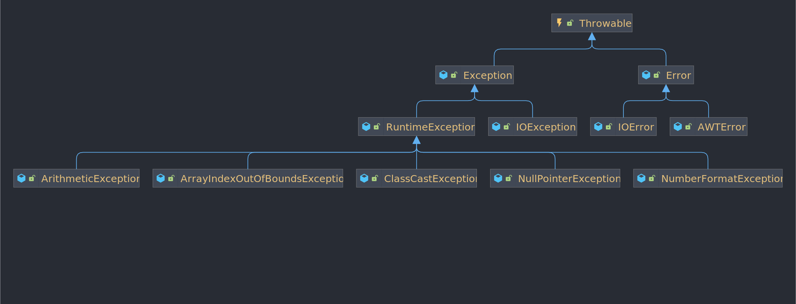

# 第三章\~异常处理

## 3.1 异常的概念及分类 <a href="#3.1-concept-and-classification-of-anomalies" id="3.1-concept-and-classification-of-anomalies"></a>

<mark style="background-color:red;">异常是指程序在运行时出现的错误或非正常情况</mark>



* Error 类：称为错误类，它表示 Java 程序运行时产生的系统内部错误和资源耗尽的错误，这类错误比较严重，仅靠修改程序本身是不能被恢复执行的
* Exception 类：称为异常类，他表示程序本身可以处理的错误，在 Java 程序中进行异常处理都是基于 Exception 类及其子类，其中 Exception子类 RuntimeException 及其子类表示运行时异常，其它异常都表示编译时异常，需要在编码时进行显示处理

## 3.2 常用的异常类 <a href="#3.2-common-exceptions" id="3.2-common-exceptions"></a>

NumberFormatException：字符串到数字的格式化异常

NullPointerException：使用了一个空对象的异常

IndexOutOfBoundsException：索引越界异常

ArrayIndexOutOfBoundsException：数组索引越界异常

ArithmeticException：算术异常

ClassCastException：类型转换异常

## 3.3 异常的捕获与处理 <a href="#3.3-exception-capture-and-handling" id="3.3-exception-capture-and-handling"></a>

对于编译时异常，都需要使用 try-catch\[-finally] 显示处理或者，或者也使用 throws 显示抛出

```java
class Test {
    public static void main(String[] args) {
        try {
            int a = 1 / 0;
        } catch (ArithmeticException e) {
            System.out.println("出现算数异常");
        } catch (Exception e) {
            System.out.println("出现异常");
        } finally {
            System.out.println("资源处理");
        }
    }
}
```

上面的程序运行会输出：

`出现算数异常\n资源处理`

## 3.4 异常的抛出 <a href="#3.4-exception-throw" id="3.4-exception-throw"></a>

异常抛出已使用 `throw` 语句或一个方法不想处理异常可以通过 `throws` 声明该方法会抛出的异常

```java
class Test {
    
    public static void main(String[] args) {
        // 因为 add 显示抛出了编译时异常，所有必须使用 try-catch 进行捕获，或者也使用 throws 抛出
        try {
            System.out.println(add(1, 1));
            System.out.println(add(1, 10));
        } catch(Exception e) {
            System.out.println(e.getMessage());
        }
    }
    
    public static int add(int a, int b) throws Exception {
        if (a > 9 || b > 9) throw new Exception("参数需要小于10");
        return a + b;
    }
}
```

上面的程序运行会输出

`2\n参数需要小于10`
