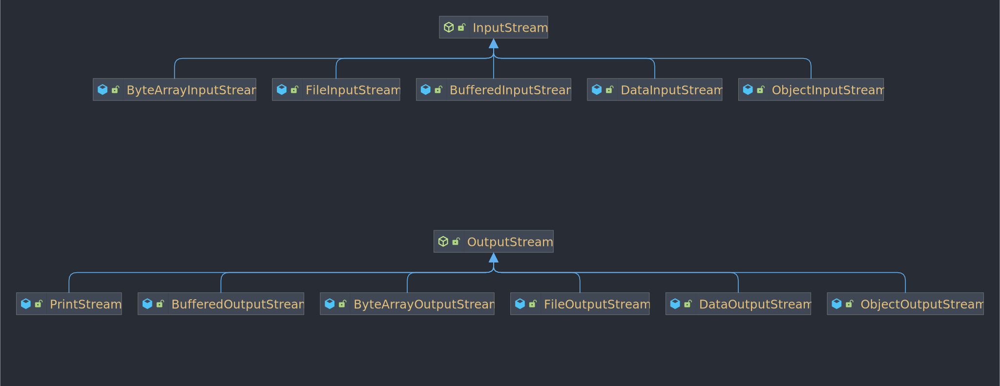
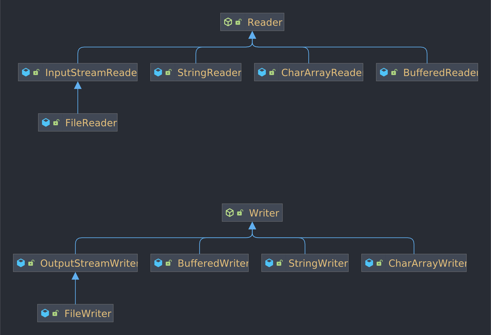
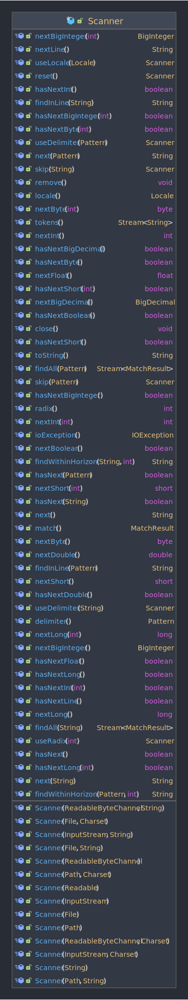
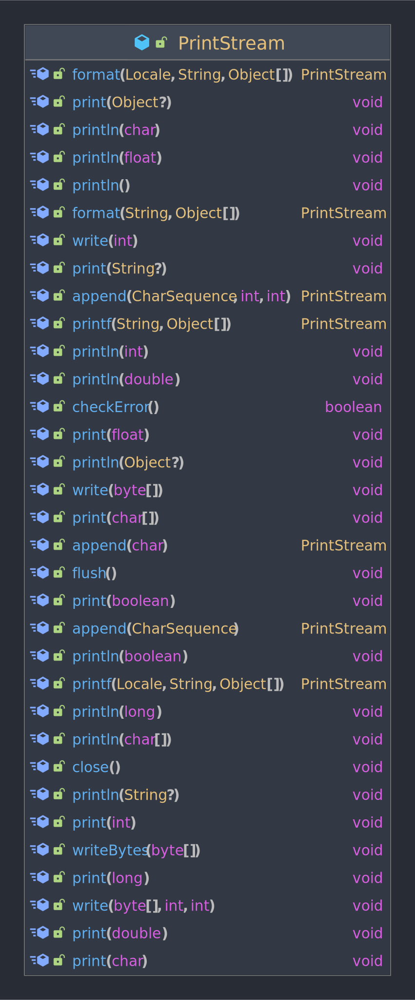
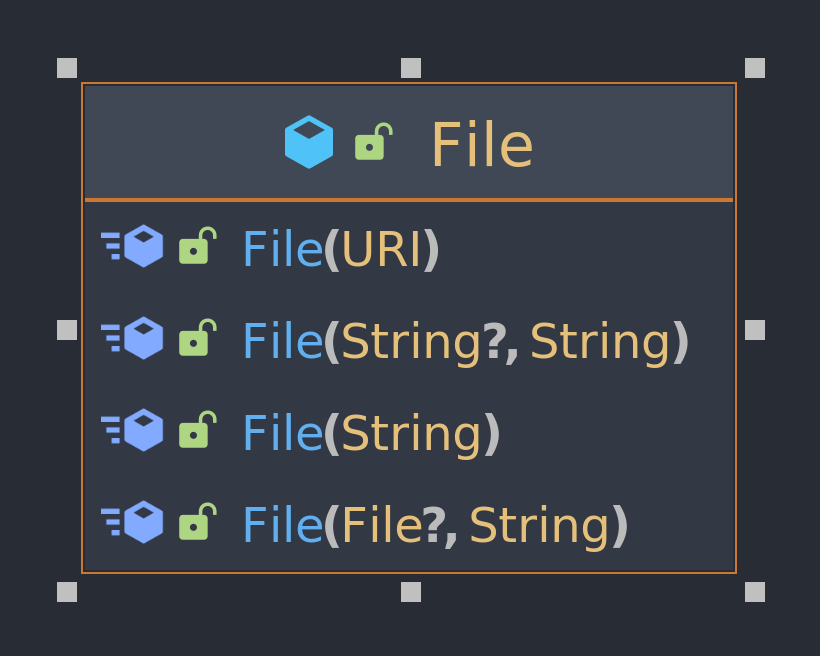

# 第五章\~输入输出流及文件操作

## 5.1 流的分类

输入流：程序自己读取数据的流

输出流：程序向外部输出数据

字节流：以字节为单位读取数据

字符流：以字符为单位读取数据

节点流：可以从或向一个特定的地方（节点）读写数据。如 FileReader

过滤流：又称处理流，是对一个已存在的流的连接和封装，通过所封装的流的功能调用实现数据读写，如 BufferedReader

## 5.2 常用流





## 5.3 系统标准输入输出操作

System.in 是 InputStream 流

System.out 是 PrintStream 流

输入一般使用 `new Scanner(System.in)` 进行处理



输出一般直接使用 `PrintStream` 的方法



## 5.4 File 类



| 操作        | 方法                                                                                                           | 说明                                                  |
| --------- | ------------------------------------------------------------------------------------------------------------ | --------------------------------------------------- |
| 文件或目录是否存在 | `exists()`                                                                                                   | 存在返回 true 否则返回 false                                |
| 文件创建      | `createNewFile()`                                                                                            | 抛出 `IOException`                                    |
| 文件删除      | `delete()`                                                                                                   | 删除成功返回 true 否则返回 false                              |
| 文件夹创建     | `mkdir() or mkdirs()`                                                                                        | 创建了文件并成功了返回 true 否则返回 false, 前者要求父文件夹存在             |
| 目录列表      | <p>list()<br>list(FilenameFileter)<br>listFiles()<br>listFiles(Filename Filter)<br>listFiles(FileFilter)</p> | <p>list(...) 获取文件名<br>listFile(...) 获取子 File 对象</p> |
| 文件重命名     | renameTo(File)                                                                                               | 成功返回 true 否则返回 false                                |


```java
@FunctionalInterface
public interface FilenameFilter {

    boolean accept(File dir, String name);
}

file.list(); // 包含所有子 File 名
file.list((dir, name) -> true); // 包含所有子 File 名

@FunctionalInterface
public interface FileFilter {

    boolean accept(File pathname);
}

file.listFiles(); // 包含所有子 File
file.listFiles((dir, file) -> true); // 包含所有子 File
file.listFiles(dir -> true); // 包含所有子 File
```

